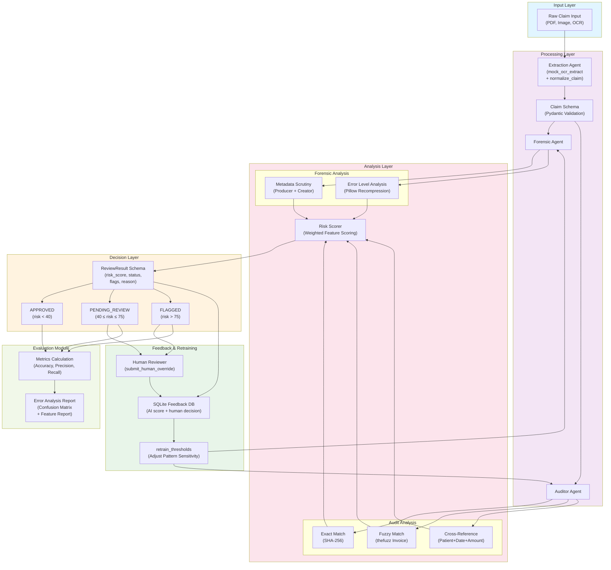

# ClaimFraudDetection Architecture Overview

## System Architecture Diagram

## Architecture Layers

### 1. **Input Layer**
- Accepts raw claim data in multiple formats (PDF, images, OCR payloads)

### 2. **Processing Layer**
- **Extraction Agent**: Normalizes and extracts data from raw inputs
- **Claim Schema**: Validates extracted data using Pydantic models

### 3. **Analysis Layer**
- **Forensic Analysis**: Examines PDF metadata and image integrity
  - Metadata Scrutiny: Checks producer and creator fields
  - Error Level Analysis: Detects image manipulation via Pillow recompression
  
- **Audit Analysis**: Cross-references and deduplication checks
  - Exact Match: SHA-256 fingerprinting for identical claims
  - Fuzzy Match: Invoice similarity matching via thefuzz
  - Cross-Reference: Validates patient, date, and amount correlations
  
- **Risk Scorer**: Combines all signals with weighted feature scoring

### 4. **Decision Layer**
- Generates `ReviewResult` with risk score, status, flags, and reasoning
- Routes claims to one of three categories:
  - **APPROVED**: Risk score < 40
  - **PENDING_REVIEW**: Risk score between 40–75
  - **FLAGGED**: Risk score > 75

### 5. **Feedback & Retraining Layer**
- **Human Reviewer**: Reviews pending and flagged claims
- **SQLite Feedback DB**: Stores AI scores and human decisions
- **Retraining**: Adjusts forensic and audit thresholds based on human feedback

### 6. **Evaluation Module**
- Calculates performance metrics (Accuracy, Precision, Recall)
- Generates confusion matrix and feature-level error analysis
- Produces comprehensive error reports

## Data Flow Summary

1. Raw claim data is normalized and validated into a `Claim` model
2. Forensic and Auditor agents analyze the claim in parallel
3. All feature signals feed the risk scorer
4. Risk score determines the claim status and routing
5. Human decisions refine thresholds over time
6. Evaluation module tracks system performance
