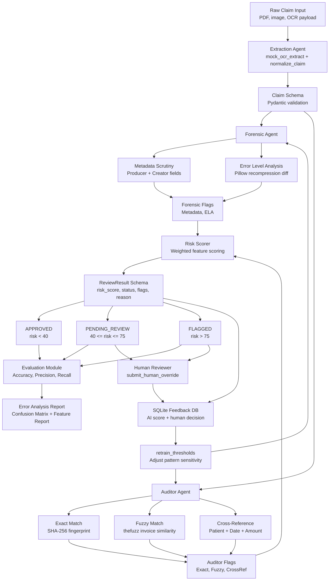

# ClaimFraudCheck Data Flow Diagram

## Flow Summary

1. Raw claim data is normalized and validated into a `Claim` model.
2. The Forensic Agent checks PDF metadata and runs ELA image analysis.
3. The Auditor Agent checks exact duplicates, fuzzy invoice matches, and patient/date/amount cross-references.
4. All feature signals feed the risk scorer, which creates a `ReviewResult`.
5. Claims are routed to `APPROVED`, `PENDING_REVIEW`, or `FLAGGED`.
6. Human decisions are stored in SQLite and used by `retrain_thresholds()` to adjust sensitivity over time.
7. The Evaluation module prints metrics, a confusion matrix, and feature-level error analysis.
